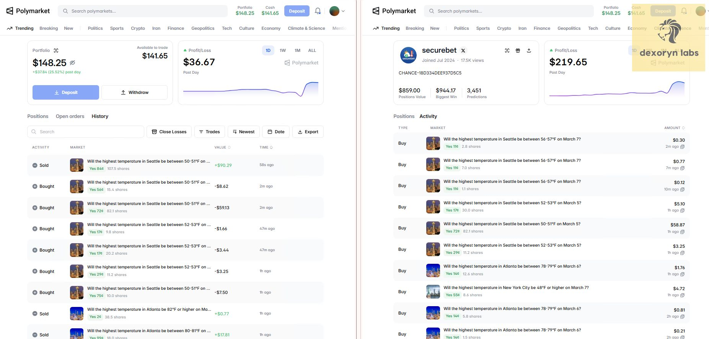

# Polymarket Bot | Polymarket Trading Bot | Polymarket Copy Trading Bot  

**Languages:** [English](README.md) · [中文](README.zh-CN.md) · [Русский](README.ru.md)

> **Automated Polymarket copy trading bot that mirrors active traders in real time**  
> **Live tested • Real on-chain execution • Swap targets anytime**

> **Need help or an updated build?**  
> 📱 **Telegram**: [t.me/dexoryn](https://t.me/dexoryn) | 🎮 **Discord**: `dexoryn_`

---

## 🎥 Live Profit Videos (Historical — Gabagool22)

These sessions were recorded while **@gabagool22** was actively trading. They show the bot executing real copy trades on-chain—not a simulation.

**Wallet (historical target):** `0x6031b6eed1c97e853c6e0f03ad3ce3529351f96d`

> **Note:** Gabagool22 is no longer a reliable copy target. The videos remain proof that the bot worked in production; you should point `USER_ADDRESSES` at traders who are **active today**. See [Story 3](#story-3--bot-still-running-after-gabagool22-stopped) below.

### Video 1 — Live Copy Trading Run

https://github.com/user-attachments/assets/2194ef92-b0f7-40e1-9835-4d2965e85e81

- **+$80 profit in ~15 minutes**
- Bot ran unattended during this session
- Real on-chain execution, not simulation

### Video 2 — Second run (confirmation)

https://github.com/user-attachments/assets/df3a6791-89b5-4230-ae40-fb7130dcadc4

- **Additional +$230 profit in the next ~15 minutes**
- Same bot, same logic, separate run
- Fully automated copy trading

---

## 📖 Live Test Stories (Real Usage)

### Story 1 — Unattended session (Gabagool22 era)

After updating the bot, I ran it to test the new logic and left it running while I went out to play billiards with friends.

About one hour later, when I returned:

- ✅ The bot was running normally
- ✅ It was copy trading accurately
- ✅ Trades matched the target trader's transactions
- ✅ The bot had already generated profit

This was a fully unattended live run, not a simulation or backtest.

---

### Story 2 — Repeatable performance (video runs)

The two videos above are from **separate live sessions** on different days. Same codebase, same monitoring and execution pipeline—no manual clicking through Polymarket. That repeatability is what we optimize for: stable automation, not a one-off lucky trade.

---

### Story 3 — Bot still running after Gabagool22 stopped

<a id="story-3--bot-still-running-after-gabagool22-stopped"></a>

Gabagool22 eventually **slowed down and stopped being a practical copy target**—fewer trades, different behavior, or simply going inactive. A lot of copy traders hit the same wall: the wallet that worked last month goes quiet, and their bot looks "broken" when the real issue is an **empty signal**, not broken software.

What we did:

- Kept the **same bot** running—no rewrite, no new product
- Updated `USER_ADDRESSES` to **other active Polymarket wallets** (use the research scripts under `src/scripts/research/` or your own due diligence)
- Confirmed the full pipeline still works: trade detection → sizing → order posting → logging

What we saw:

- ✅ Process stayed up and healthy
- ✅ New target trades were detected and mirrored correctly
- ✅ Logs and MongoDB history updated as expected
- ✅ Failures were isolated to market/order edge cases, not "bot died when Gabagool22 left"

#### Perfect copy-trading result — mirroring **securebet**

After switching targets, we copied [**securebet**](https://polymarket.com/@securebet) and captured this side-by-side:

<p align="center">
  
</p>

**This is what ideal copy trading looks like.** Your bot wallet (left) and the target trader (right) show the **same PnL chart shape** for the day—the same flat period, dip, and recovery spike at the end. Dollar amounts differ because of your sizing (`COPY_SIZE`, multipliers, and balance), but the **curve tracks the leader**, which means trades are being detected and mirrored in sync—not lagging behind or fighting the strategy.

Same session, same markets in the activity/history tabs (e.g. the temperature markets visible in the screenshot). That alignment is the proof traders care about: **follow the wallet, get the same equity curve pattern.**

**Takeaway for traders:** This bot is built to follow **whoever you configure**, not one celebrity wallet. When a trader stops working for you, **change the address—not the bot.** Past Gabagool22 results do not guarantee future results on any target.

---

## ⭐ Why This Bot

### 🎯 Real proof, not just claims

Other Polymarket bots often stop at screenshots. This repo includes **video proof** of live execution plus the stories above—including running correctly **after** the original star trader went inactive.

### 🚀 Architecture & performance

- **Centralized `data/` layout** — logs, cache, and simulation results in one place
- **Async-first** — built on Python `asyncio` for low-latency monitoring
- **Smart caching** — fewer redundant API calls

### 💡 Features traders actually use

- **Trade aggregation** — combine small fills into executable size (helps gas and Polymarket minimums)
- **Tiered multipliers** — size positions by the leader's trade size (`TIERED_MULTIPLIERS` in `.env.example`)
- **Copy strategies** — `PERCENTAGE`, `FIXED`, or `ADAPTIVE` sizing
- **Simulation & audit tools** — backtest and validate before going live
- **Multi-trader support** — copy several wallets at once
- **1-second polling** — configurable via `FETCH_INTERVAL`

### 📈 Comparison

| Feature | This Bot | Typical alternatives |
|---------|----------|----------------------|
| **Live execution proof** | ✅ Videos + real stories | ❌ Claims only |
| **Survives target going inactive** | ✅ Change `USER_ADDRESSES` | ⚠️ Tied to one influencer |
| **Trade aggregation** | ✅ | ❌ |
| **Tiered multipliers** | ✅ | ❌ Fixed multiplier only |
| **Simulation / audit** | ✅ | ❌ |
| **Multi-trader** | ✅ | ⚠️ Limited |

---

## 🎯 Who This Is For

**Good fit:**

- Traders who want **passive exposure** to wallets they trust
- Users comfortable running **Python 3.10+** and a `.env` file
- People who understand **on-chain risk**, gas, and that leaders change over time

**Not a fit:**

- Anyone expecting **guaranteed** profits or a forever hands-off money printer
- Complete beginners who will not monitor logs or rotate targets when activity drops

---

## Quick Start

### Prerequisites

- **Python 3.10+**
- **MongoDB** — [MongoDB Atlas](https://www.mongodb.com/cloud/atlas/register) free tier is fine
- **Polygon wallet** — USDC for trading, POL/MATIC for gas
- **RPC URL** — [Infura](https://infura.io) or [Alchemy](https://www.alchemy.com)

### Installation

```bash
git clone https://github.com/dexorynlabs/polymarket-trading-bot-python.git
cd polymarket-trading-bot-python

pip install -r requirements.txt

# Edit config.yaml — set target_wallet and mode (see Configuration below)
python -m app.main
```

**Help:** [@dexoryn](https://t.me/dexoryn) on Telegram.

---

## Configuration

Edit `config.yaml` in the project root. Start with `mode: dry_run` to verify the bot detects and logs target fills before going live.

### Essential settings

| Setting | Description | Example |
|---------|-------------|---------|
| `target_wallet` | Polymarket wallet to copy | `0x6031b6e...` |
| `mode` | `dry_run` logs only; `real` submits orders | `dry_run` |
| `sizing.mode` | `fixed` USD per copy or `percent_of_target` | `fixed` |
| `sizing.fixed_usd_per_fill` | USD per copy (when `sizing.mode=fixed`) | `10.0` |
| `sizing.percent_of_target` | Fraction of target chunk (when `sizing.mode=percent_of_target`) | `0.05` |
| `sizing.max_usd_total_in_positions` | Global cap on open position cost | `100.0` |
| `sizing.min_target_shares_to_copy` | Batch threshold before copying | `10` |
| `execution.order_type` | `taker` (FAK) or `maker` (GTC) | `taker` |
| `slippage.entry_bps_max` | Max slippage above target price (bps) | `200` |

For `mode: real`, uncomment and fill the `polymarket:` section with `private_key`, `wallet_address`, `api_key`, `api_secret`, and `passphrase`. See **`config.yaml`** for maker settings, position expiry, dedup, and watchdog options.

### Pick a trader to copy

Choose an active Polymarket wallet and set `target_wallet` in `config.yaml`. Verify activity and risk on [polymarket.com](https://polymarket.com) before copying.

---

## Safety & Risk Management

⚠️ **This bot places real trades with real funds when `mode: real`.**

- Start with `mode: dry_run` and confirm fills are mirrored in logs
- **Rotate targets** when a trader goes quiet—Gabagool22 is a lesson, not a permanent setting
- Set `sizing.max_usd_total_in_positions` conservatively
- Check `logs/tracecopy.log` regularly; state persists in `state.json`
- Past performance (including the videos) **does not** guarantee future results

1. Use a dedicated wallet with limited balance  
2. Never commit `config.yaml` with live secrets or share `private_key`  
3. Know how to stop the bot (`Ctrl+C`)  
4. Research wallets before setting `target_wallet`

---

## FAQ

**Can I still copy Gabagool22?**  
You can set any address, but Gabagool22 is **not recommended** anymore—activity dropped. Use research scripts or your own list of **currently active** traders.

**What if my target stops trading?**  
The bot keeps running; you won't see new copies until you point `USER_ADDRESSES` at active wallets. That's expected—not a bot failure.

**Does this work on all Polymarket markets?**  
Standard markets are supported; exotic or illiquid cases may fail individually and get logged/retried.

**Is this open source?**  
Yes. A maintained premium build with extra support is also available via Telegram.

---

## Author & Contact

**Dexoryn Labs** — Polymarket copy-trading automation

- **Telegram**: [@dexoryn](https://t.me/dexoryn) (fastest)
- **Discord**: `dexoryn_`
- **Twitter**: [@dexoryn](https://x.com/dexoryn)
- **GitHub**: [@dexorynLabs](https://github.com/dexorynLabs)
- **WeChat**: scan to add **DexorynWe**

<p align="center">
  
  &nbsp;&nbsp;
  
</p>

---

## Contributing

1. Fork the repo  
2. `git checkout -b feature/your-feature`  
3. Commit and push  
4. Open a Pull Request  

---

## Legal Disclaimer

Trading on Polymarket involves **substantial risk of loss**. Dexoryn is not responsible for losses from using this software. You are solely responsible for wallet security, target selection, and capital at risk.

**Only trade with funds you can afford to lose.**

---

If this project helps you, consider ⭐ starring the repo or opening issues/PRs. Questions: [@dexoryn](https://t.me/dexoryn).
